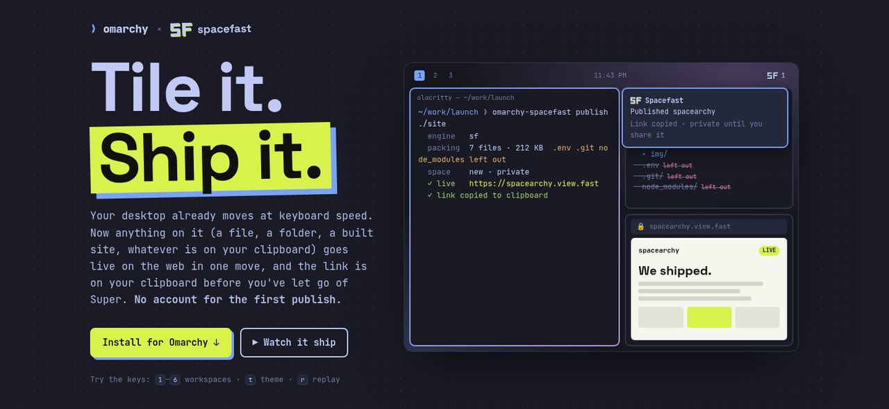

# omarchy-spacefast

**Tile it. Ship it.** Put things on the web from [Omarchy](https://omarchy.org) with
[Spacefast](https://spacefast.com).

[](https://spacearchy.view.fast/)

**[See it live at spacearchy.view.fast →](https://spacearchy.view.fast/)** That page is itself a
Spacefast space, published from an Omarchy machine with `omarchy-spacefast publish ./site`.
Press `t` there to try it in every Omarchy theme.

Your desktop already moves at keyboard speed. Now anything on it goes live on the web in one
move: a file, a folder, a built site, or whatever is on your clipboard. The link lands on your
clipboard, a notification tells you it's up, and the SF in your bar keeps track of it.
**No account is needed for the first publish.**

- **Omarchy-shaped.** It lives in the menu you already use, the bar you already look at, and
  the terminal you already live in. It even wears your theme (the lime stays).
- **Safe by default.** Spaces start private. Claim keys are stored mode 600 and never printed.
  `.env*`, `.git`, and `node_modules` never leave your machine.
- **Plain and inspectable.** One bash script with `jq` and `curl`. No daemon. The uninstaller
  removes exactly what the installer added. The same script runs on macOS: the
  [Alfred workflow](https://github.com/alansmodic/alfred-spacefast) bundles it.
- **Real hosting.** Spacefast runs on WordPress.com infrastructure. Every publish is an
  immutable version, and republishing updates the same space instead of making a new one.

There are three pieces. Install them together or one at a time:

| Piece | What you get | Folder |
|---|---|---|
| **Share menu** | Omarchy menu → Trigger → Share → **Web**: publish a file, folder, or the clipboard; My Spaces; Sign in | [`share/`](share) |
| **Bar widget** | A Spacefast button in the bar. Click it for your spaces (open, copy a share link, claim), right-click to publish a folder | [`plugin/`](plugin) |
| **Agent skill** | Ask Claude Code, Codex, or pi to "put this online" and they offer Spacefast. They still use another host if you name one or the project already has one | [`skill/`](skill) |

All three share one small command, [`omarchy-spacefast`](bin/omarchy-spacefast), which does
the publishing.

## Install

Thirty seconds to your first link.

```bash
git clone https://github.com/alansmodic/omarchy-spacefast.git omarchy-spacefast && cd omarchy-spacefast
./install.sh                 # everything
./install.sh share skill     # only the pieces you name: share, plugin, skill
./install.sh --uninstall     # remove everything (or: ./install.sh plugin --uninstall)
```

Each folder also installs on its own (`share/install.sh`, `plugin/install.sh`,
`skill/install.sh`). `scripts/build-dist.sh` packs each piece into its own tarball so you can
pass one along without the rest.

The bar widget can also live in its own repository, since Omarchy installs plugins from git:

```bash
omarchy plugin add https://github.com/alansmodic/omarchy-spacefast-plugin.git --enable
```

`scripts/build-dist.sh` writes that repository's contents to `dist/omarchy-spacefast-plugin/`.

### What gets installed where

| Piece | Files |
|---|---|
| Share menu | `~/.local/bin/omarchy-spacefast`, plus a marked block in `~/.config/omarchy/extensions/omarchy-menu.jsonc`. Uninstall removes exactly that block |
| Bar widget | `~/.config/omarchy/plugins/spacefast.spaces/`, placed on the right of the bar |
| Agent skill | `~/.local/share/omarchy-spacefast/skills/omarchy-spacefast`, linked into `~/.agents/skills`, `~/.claude/skills`, `~/.codex/skills` and `~/.pi/agent/skills` (for the agents you have) |
| Spacefast CLI | `sf`, installed with `omarchy-mise-install npm:spacefast sf`, the same way Omarchy ships its other npm tools. Skip it with `--no-cli` |

Requirements: `jq` and `curl` (both come with Omarchy). The `sf` CLI is optional. Without it,
publishing falls back to a single anonymous upload with curl.

## How publishing works

- **Engine.** `omarchy-spacefast` zips the files and publishes them over the Spacefast HTTP API
  with curl. If you are not signed in here but the `sf` CLI is, it publishes through `sf`
  instead. `OMARCHY_SPACEFAST_ENGINE=curl` or `=sf` forces one.
- **Updates, not duplicates.** Publishing the same file or folder again updates its space and
  adds a new immutable version (`v2`, `v3`, …). Use `--new` to create a separate space.
- **Anonymous (not signed in).**
  - The space is private.
  - You get a private preview link, which is copied for you and must not be shared because it
    can manage the space.
  - The space expires about 33 hours after the last publish unless you claim it. Claiming signs
    you in with WordPress.com. Click the notification, or run `omarchy-spacefast claim <id>`.
- **Signed in (`omarchy-spacefast login`).** The same device flow as `sf login`: approve a code in
  the browser. If your account has several teams, pick where new spaces go with
  `omarchy-spacefast team <slug>`. `omarchy-spacefast logout` revokes this machine's key.
  - The space is kept.
  - A viewer share link is created and copied. Set `OMARCHY_SPACEFAST_ACCESS=public` to make
    new spaces public, or `=private` to skip the share link.
- **What gets left out.** `.env*` files, `.git`, `node_modules`, `.spacefast`, `.DS_Store` and
  symlinks are never uploaded. Inside a git repository, git-ignored files are left out too.
- **Clipboard.** Images become an image page, HTML is published as-is, and text becomes a
  readable page.

```bash
omarchy-spacefast publish ./dist           # a folder or built site
omarchy-spacefast publish report.html      # one file
omarchy-spacefast publish clipboard        # whatever is on the clipboard
omarchy-spacefast spaces                   # recent publishes + your account's spaces
omarchy-spacefast copy|open|claim <id>
omarchy-spacefast login | logout | team [slug]
omarchy-spacefast status
```

## Known issues

- **Several teams, no default.** If your Spacefast account belongs to more than one team, new
  spaces need a team: pick one with `omarchy-spacefast team <slug>`, or pass `--team <slug>` /
  set `SPACEFAST_TEAM`. (If you narrow the sign-in to one team on the approval page, that team
  is used.)
- **The approval page says "Spacefast CLI".** Device sign-in only accepts client ids Spacefast
  already knows, so this signs in as the CLI does.
- **`sf` through mise.** mise's supply-chain check currently refuses `spacefast@0.4.1` from npm.
  An earlier release was published with npm trusted-publisher provenance and this one has none.
  The installers detect this and remove the broken `sf` wrapper. Nothing depends on `sf` any
  more: publishing and signing in go straight to the API. The fix belongs upstream: publishing
  `spacefast` releases with provenance.

## Security notes

- Space keys, anonymous preview links, and the sign-in key are stored only in
  `~/.local/state/omarchy-spacefast/secrets.json` (mode 600; the macOS Keychain on a Mac).
  `spaces.json` holds nothing secret, and 0.1's keys move out of it on first run. `--json`
  output, the bar widget, and the agent skill never show them. On macOS, preview links are
  copied as concealed so clipboard history does not keep them.
- The bar panel takes keyboard focus when it opens. So publishing and signing in are
  **click-only**: a stray keystroke can't send anything to the internet. Every publish from the
  menu or panel also goes through the file chooser, except "Clipboard", which you pick
  explicitly.
- The skill tells agents to confirm before publishing, to publish the narrowest folder, and never
  to print credentials.

## Making it an Omarchy default

If Omarchy wanted this out of the box, the changes upstream would be small:

1. **CLI:** add `omarchy-mise-install npm:spacefast sf` to `install/user/mise.sh`.
2. **Menu:** add the `trigger.share.web.*` entries from [`share/menu.jsonc`](share/menu.jsonc) to
   `default/omarchy/omarchy-menu.jsonc`, and ship `bin/omarchy-spacefast` as a regular
   `omarchy-*` command.
3. **Skill:** add `skill/omarchy-spacefast` under `default/agents/skills/`, with a migration that
   links it the way the `omarchy` skill is linked.
4. **Widget:** keep it third-party, installable with `omarchy plugin add`, or ship it disabled.

## License

MIT
